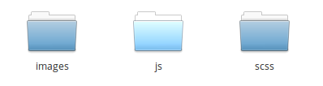
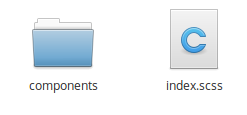

# Webpack

- [Webpack](#webpack)
    - [Requirements](#requirements)
        - [Node](#node)
        - [NPM](#npm)
        - [Please note](#please-note)
    - [Webpack is flexible](#webpack-is-flexible)
    - [what does it do](#what-does-it-do)
        - [Commands](#commands)

Assets play an important role in any website, and through the years there's been a lot of asset management tools.
We finally found one that we think is good enough, and we have opted to use [`Webpack`](https://webpack.js.org/) as our asset management tool.

Assets will be taken from the `ModuleName/assets` directory, transpiled, and added to the `public/ModuleName` and you should reference this location in your HTML.

> Please note the system will remove everything in the app folder before running the production command, to remove any old unusued items, so **DO NOT** add anything to the public folder manually

## Requirements

### Node

Since webpack relies on node-modules to run correctly, and since we can import these in our Javascript and Scss, **Node** must be installed on the dev machine

### NPM

NPM be part of the **Node** installation, but if you manage to only install Node, please be advised that **NPM** is required too.

### Please note

Webpack is only ever supposed to run on the development machine. You should **NEVER** install the node-modules on your production machine.

Simply run the production command before pushing to git, and when you deploy you get the production-ready assets without having Node on your production machine.

## Webpack is flexible

The flexibility of webpack pursuaded us into using it. A long with every frontend install, a `webpack.conf.js` file is present. This file is the configuration for webpack, and should by default fit most applications.

The configuration is set to take care of the following filetypes:

- Sass/Scss
- Javascript
- Typescript
- Images
- Fonts

and does have a few requirements to work.

1) If you add more components, register in the `appModules` array in the config file.
1) All types of files should be in their own directory, eg. `scss` in a `/scss/` directory
1) Only items in the outmost directory will be used, so feel free to create a `components` directory inside `scss` and import components in your main file

> Contents of App/assets could look like this:



> Contents of the `scss` folder could look like this:



## what does it do

Webpack has two modes, `production` and `development`.

In **development**, webpack helps you by creating sourcemaps for easier debugging and better overview.

In **production**, all assets are minified and prepared for production use, and no sourcemaps will be generated.

### Commands

Our config comes with three commands

```bash
npm run dev
```

The `dev` command runs the webpack through once, in development mode. This means it will generate sourcemaps and transpile Scss and Js into css and js that all browsers can understand.

```bash
npm run watch
```

The `watch` command works similarly to the dev command, but instead of running it through once, it keeps listening for file-changes, and whenever one of your source-file changes, it transpiles that. It remains incredibly fast by only transpiling a single source-file at a time.

> Note: if left running for a while it can get stuck, so please restart the process once in a while, or stop it when you're not using it.

```bash
npm run prod
```

The `prod` command runs the production build. This takes all the sourcefiles and minifies them, so they're ready for production.

> This should only be run just before committing.
